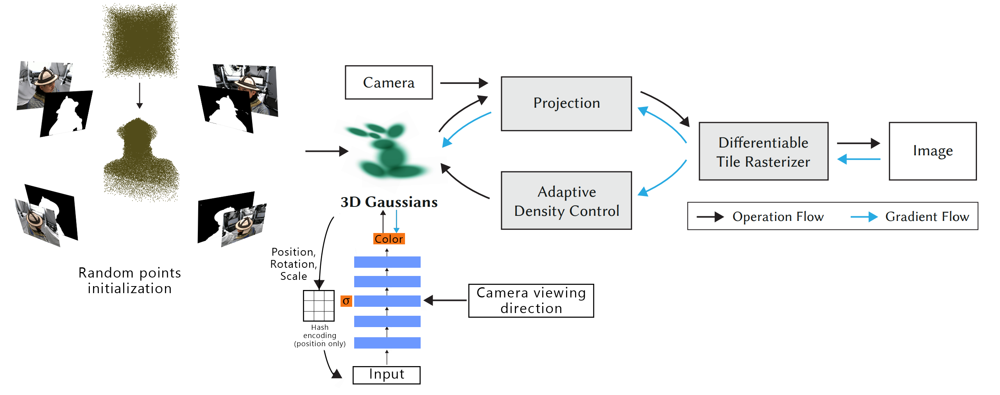

<div align="center">

# High-Quality Static Head Avatars with Gaussian Splatting

[Jiepeng (Frank) Chen](https://frankjc2022.github.io/)

<p>University of Toronto<p>

### [Paper](https://frankjc2022.github.io/static-head-avatar/assets/static_head_avatar.pdf) | [Project Page](https://frankjc2022.github.io/static-head-avatar/)

 
 

</div>

## Colab

The Colab notebook we used can be downloaded here: [static-head-avatar.ipynb](./static-head-avatar.ipynb).  
Please modify the paths in the notebook to match your specific setup.


## Dependencies

This project builds upon the official Gaussian Splatting implementation. Please follow the installation instructions in the official repository: [Gaussian Splatting GitHub Repo](https://github.com/graphdeco-inria/gaussian-splatting).

Additionally, this project requires **Tiny-CUDA-NN**. To install it, follow the instructions in its repository: [Tiny-CUDA-NN GitHub Repo](https://github.com/NVlabs/tiny-cuda-nn).

## Preparing Dataset

Our project utilizes the **RenderMe-360 dataset**, which you can apply for and download from the official website: [RenderMe-360 Dataset](https://renderme-360.github.io/inner-download.html#Download).

The preprocessing script is located at `./preprocessing/preprocessing_renderme360.py`. It has been adapted from the official Gaussian Splatting implementation. Please modify the paths in the script to match your setup before running it.

### Acknowledgment

We extend our deepest thanks to the creators of the **RenderMe-360 dataset** for providing this invaluable resource for research and development.


## Training
The training process is consistent with the official Gaussian Splatting implementation. All arguments available in the official Gaussian Splatting implementation are compatible here, with additional arguments introduced for our modifications. Below is the command we use for training:

```
python train.py -s <path to COLMAP dataset> --eval --white_background --images masked_images --masks undistorted_mask --random_init_points --n_points 50000 --mask_project_means3D --mlp_type color_opacity --direct_mlp --mlp_full_input --mlp_config_path ./mlp_networks_config.json -m <path to output folder>

```
<details>
<summary><span style="font-weight: bold;">Extra Command Line Arguments for train.py</span></summary>

  #### --source_path / -s
  Path to the source directory containing a COLMAP data set.
  #### --model_path / -m 
  Path where the trained model should be stored.
  #### --images / -i
  Subdirectory for COLMAP images. With our preprocessing script, this is located in ```masked_images```.
  #### --eval
  Add this flag to use a MipNeRF360-style training/test split for evaluation.
  #### --white_background / -w
  Add this flag to use white background instead of black (default), e.g., for evaluation of NeRF Synthetic dataset.
  #### --masks
  Subdirectory for undistorted masks. With our preprocessing script, this is located in ```undistorted_mask```.
  #### --random_init_points
  Flag to use random point initialization.
  #### --n_points
  Specify the number of points in the random initialization. Default is ```20_000```.
  #### --mask_project_means3D
  Flag to use mask projection to prune points during random point initialization.
  #### --mlp_type
  Specify what the MLP predicts. Must be one of ```color_opacity```, ```color```, or ```opacity```. Without this flag, the model will not use MLP for prediction.
  #### --direct_mlp
  Flag to directly predict RGB color and opacity. Without this flag, it predicts modifiers for SH coefficients and opacity.
  #### --mlp_full_input
  Flag to use position, rotation, and scale as the input for the MLP. Without this flag, only position is used as input.
  #### --mlp_config_path
  Indicate the path to the MLP configuration file. The file we use is located at `mlp_networks_config.json`.


</details>

## Generate Novel View Synthesis Videos
To generate novel view synthesis videos, use the following command:
```
python render_360.py -m {full_output_path} -s {source_path}
```
This script renders 150 images around the head and compiles them into a 5-second, 30fps video.

## Evaluation

The evaluation process follows the same steps as the official Gaussian Splatting implementation. Use the commands below:
```
python render.py -m <path to pre-trained model> -s <path to COLMAP dataset>
python metrics.py -m <path to pre-trained model>
```
## GPU Requirement
We trained our models using a **Google Colab T4 GPU**. 
For optimal performance, ensure you have access to a similar or higher-tier GPU with sufficient VRAM.
